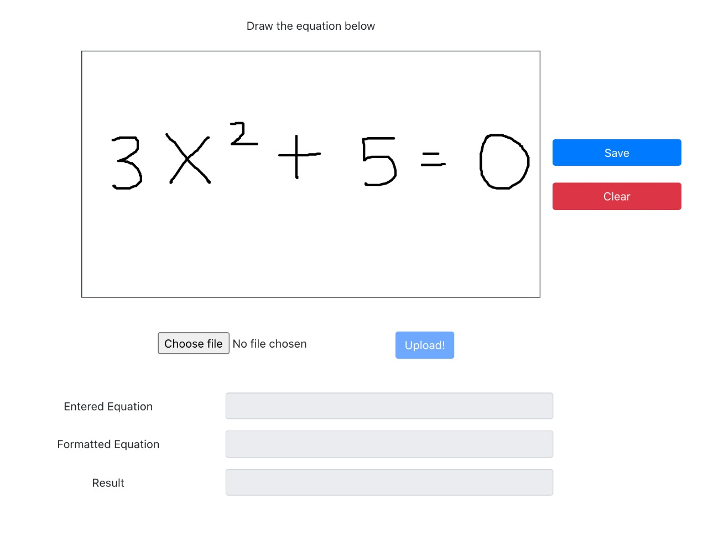
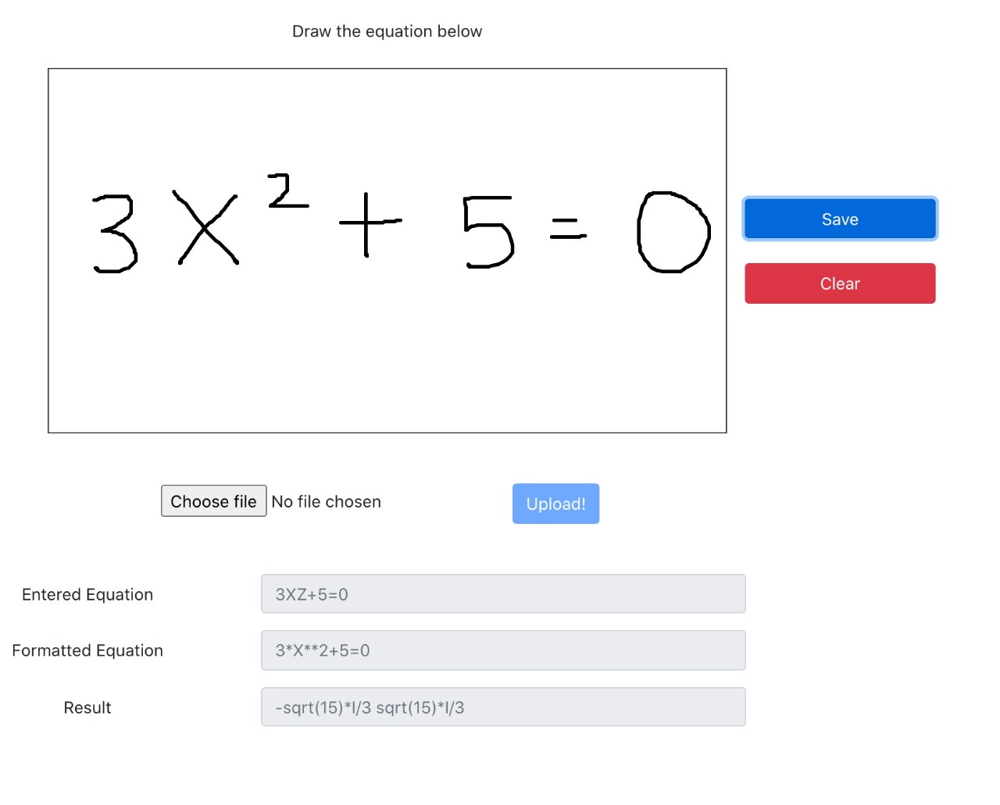
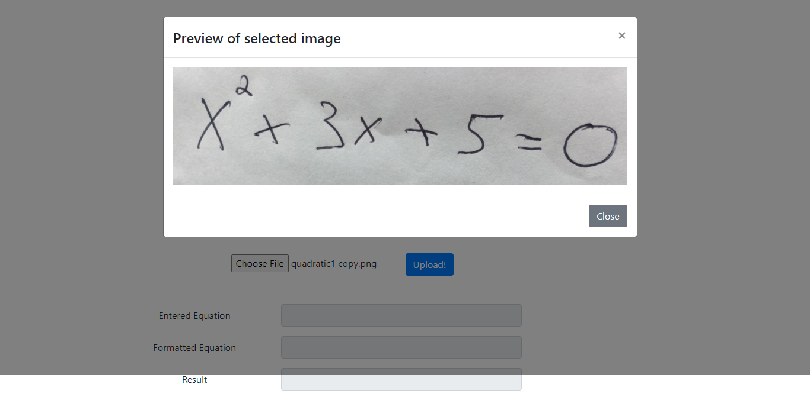
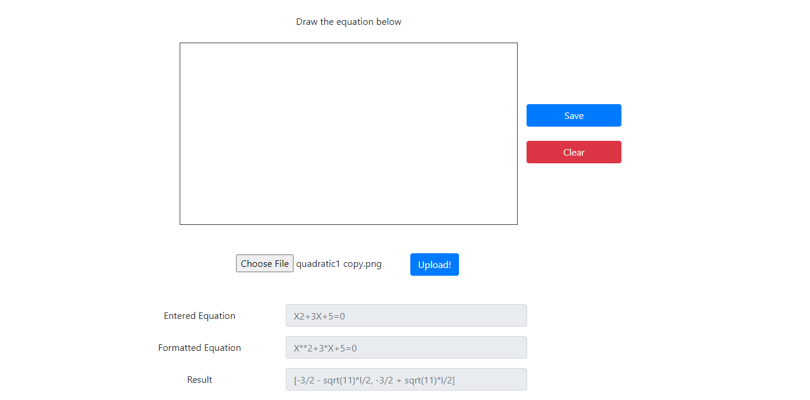
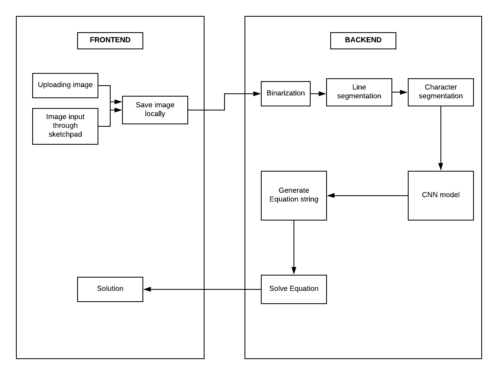
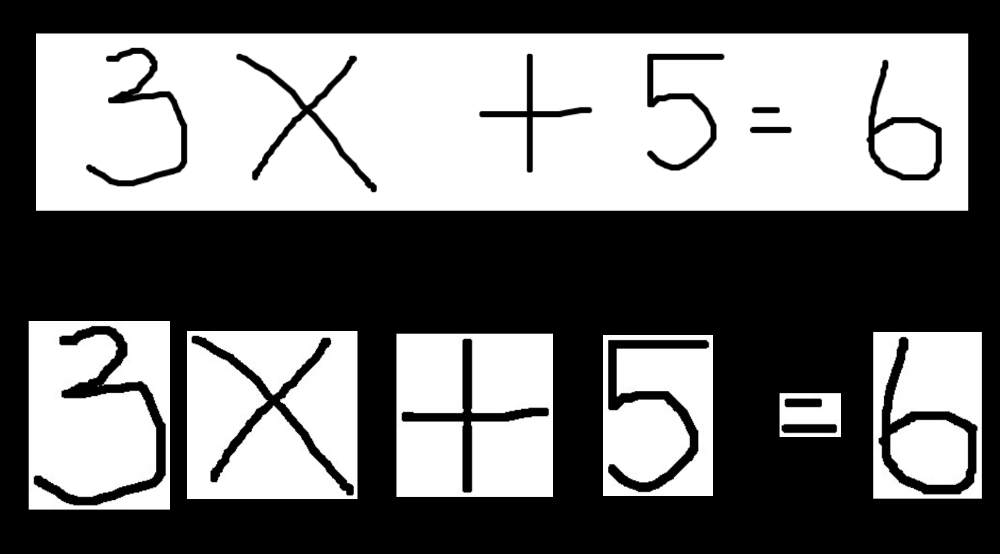

# Handwritten Equation Solver


**Handwritten Equation Solver** is an AI-powered application designed to recognize and solve handwritten mathematical equations from an input image. The system leverages cutting-edge technologies like **Optical Character Recognition (OCR)** and **Convolutional Neural Networks (CNN)** to identify characters, and solve equations ranging from basic arithmetic to complex polynomial equations.

## 🚀 Features

- **Handwritten Equation Prediction**: Supports input via sketchpad or image upload.
- **Equation Solver**: Capable of solving equations involving addition, subtraction, multiplication, division, and equations of any degree (linear, quadratic, cubic, etc.).
- **Character Recognition**: Uses CNN and OCR for accurate segmentation and prediction of handwritten characters.
- **Real-time Processing**: Get results instantly after uploading or drawing the equation.
- **Interactive Frontend**: Built using ReactJS for an intuitive user experience.

---

## 🖥️ Local Setup

To run the project locally, follow these steps:

### 📒 Prerequisites
- [Node.js](https://nodejs.org/)
- [Python 3.8+](https://www.python.org/)
- [FastAPI](https://fastapi.tiangolo.com/)

### 🔧 Installation

1. Clone the repository:
   ```bash
   git clone https://github.com/yourusername/equations-solver.git
   cd equations-solver

## Local setup

Both ReactJS and FastAPI have to be executed :

Start ReactJS using:
```
cd frontend
npm run start
```

Start FastAPI using:
```
cd api
uvicorn app:app --port:8000 --reload
```

## Docker setup

Build and run both the Frontend and API using:
```
docker-compose up --build
```
The frontend can be viewed at http://localhost:3000 and the API can be viewed at http://localhost:8000

## 📸 Result

### When image is written through sketchpad

<p float="left">
   
    
</p>

### When image is uploaded

<p float="left">
   
    
</p>

## 🔍 Overview



- The [**Frontend**](./frontend) part has been developed using `ReactJS`. Here the user enters the image either by uploading or by using the sketchpad. The image is encoded to base64 format and sent to the REST-API as a POST request.

- The [**REST-API**](./api/app.py) has been implemented using `FastAPI`. The request data is decoded and saved as an image locally and this image is sent to the backend where the equation is predicted and solved. The image processing is done using Tensorflow and OpenCV. This process can be viewed as two separate modules : Equation Prediction and Equation Solver.

  - OpenCV is used to perform binarization and line and character segmentation. A Tensorflow model trained using the EMNIST (Extended MNIST) dataset is used to predict each of the segmented characters and the equation generated is passed as a string to the Equation Solver.

  - The Equation Solver solves the mathematical equation and passes it back to the Frontend where it can be viewed.

## 🧩 Character Segmentation

The major steps include : Noise Removal, Binarization, Thresholding and Image Segmentation.

The Binarized image and the segmented images can be viewed below :



## 🔢 Solving the Equation

After each of the character in the image is detected, the string containing the equation is passed to this final module which solves the equation or mathematical expression.

The equation can be of two types :

- A mathematical string such as ‘5+3’ or ‘66x3+2’ (String that is input to this module is of this format). This string can either be evaluated using a custom-built function or the eval( ) function in python.

- A mathematical equation of any degree. The string ‘X2+5=0’ is interpreted as `X**2 + 5` since the 2 appears after the variable. Whereas `2X+5=0` is interpreted as 2\*X + 5 = 0. Since prediction of even a single character leads to incorrect results/failure, simple replacements are performed on the given string to increase accuracy. These include Z -> 2, G -> 6, B -> 8 and D -> 0. The equation is solved using the SymPy library, which is a python library for symbolic computation.

The 2 types of equations are distinguished by checking if the equation contains ‘=‘. If the equation contains ‘=‘, it is interpreted as the 2nd type, otherwise it is interpreted as the 1st type.

## 📚 Links

[Link to the presentation](https://drive.google.com/file/d/1f7ZVFmpK5mBtrZ68hBml8bGoJ_VRc_ih/view?usp=sharing)

## References

[Introduction to CNN Keras](https://www.kaggle.com/yassineghouzam/introduction-to-cnn-keras-0-997-top-6)

[Character Segmentation](https://github.com/dishank-b/Character_Segmentation)

[ReactJS - Getting Started](https://reactjs.org/docs/getting-started.html)

[React - P5 Wrapper](https://github.com/and-who/react-p5-wrapper)

[React bootstrap](https://react-bootstrap.github.io/)

## 🤝 Contributing
We enthusiastically welcome contributions, pull requests are most welcome! Your input is invaluable, and we appreciate any contributions, whether they are major changes or minor enhancements.
